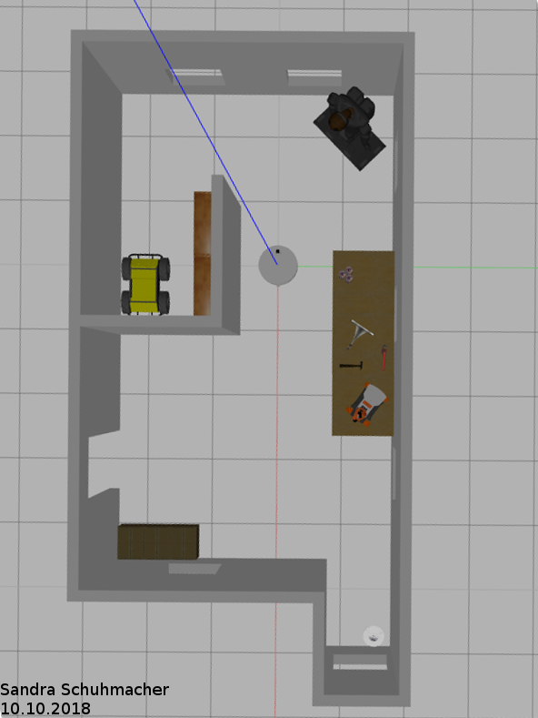

# Map My World
This is the SLAM project of the Udacity Robotics Software Engineer Nanodegree. 
It uses Real-Time Appearance Based Mapping (RTAB-Map) in ROS to perform SLAM in a simulated environment. 

# Writeup
The writeup can be found in ``report/writeup.pdf``

## Installation & Build
### ROS Kinetic
The project was developed on Ubuntu 16.04 LTS with [ROS Kinetic](http://wiki.ros.org/kinetic), [Gazebo](http://gazebosim.org/) and [catkin](http://wiki.ros.org/catkin) installed.

### Dependencies
- ``rtabmap_ros`` ROS package

### Building the Workspace
Use ``catkin`` to build the packages from source. First create a catkin workspace:

- ``mkdir -p ~/catkin_ws/src``
- ``cd ~/catkin_ws/src``
- ``catkin_init_workspace``
- ``cd ~/catkin_ws``
- ``catkin_make; source devel/setup.bash``
- ``cd ~/catkin_ws/src``

Then clone the project and rebuild
- ``git clone https://github.com/yulivee/RoboNDMapMyWorld.git``
- ``cd ~/catkin_ws``
- ``catkin_make; source devel/setup.bash``

### Launching the project
Run these scripts in the specified order to launch the SLAM World

Launch the kitchen-dining world in Gazebo:

``roslaunch udacity_bot udacity_world.launch``

Alternatively, launch the robot-workshop world of my own design in Gazebo:

``roslaunch udacity_bot robot_workshop.launch``

Launch the teleop node for keyboard control:

``roslaunch udacity_bot teleop.launch``

Launch the RTAB-Map mapping node

``roslaunch udacity_bot mapping.launch``

Launch the RViz GUI:

``roslaunch udacity_bot rviz.launch``

#### Robot Model
The robot model was extended from the previous project ``Where Am I?``. 
It features an RGB-D camera to input depth information to RTAB-Map.

First the mapping was performed using a provided kitchen-world by Udacity. Then a small Robot Workshop with some tools
and Boxes as obstacles was built and used for mapping purposes:

### RTAB Map Database Files
The RTAB Map Database Files are far too large for github and can be found on Google Drive:
[rtabmap databases](https://drive.google.com/drive/folders/1TRlFdQ7RH5_eNYgxeBXV7xO3pfS_8Yoy?usp=sharing)
